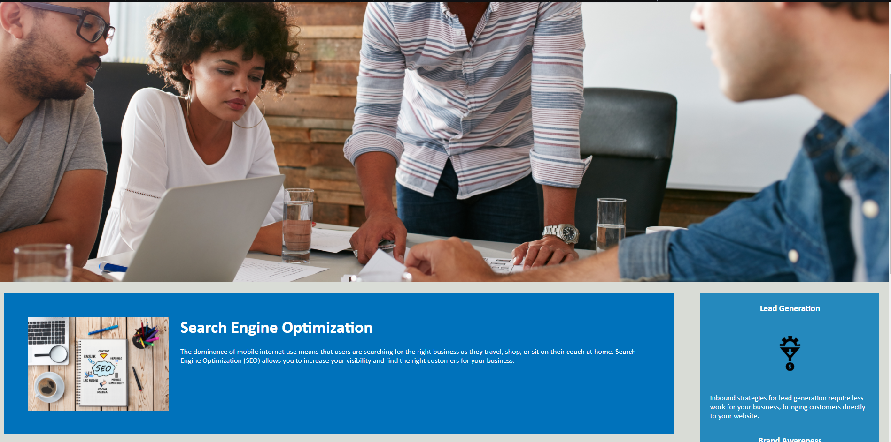

CD A# Adapting Horiseon's Website to Meet Accesability Standards

Horiseon Social Solution Services, Inc. (Client) has contracted DiamondSoft LLC to update Client's website to meet modern web accesibility standards. Final scope of work includes:

1. Updating HTML to allow for improved function of screen readers
2. Consolidation of CSS to increase efficiency of development in future scopes of work

## HTML Improvements

Eliminated div soup and added semantic elements header, nav, section, article, and aside.

## CSS Improvements

Over 100 lines of code eliminated. Removed redundant rules and declarations!!

## Screenshot!

